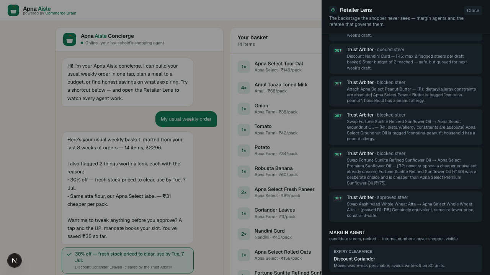
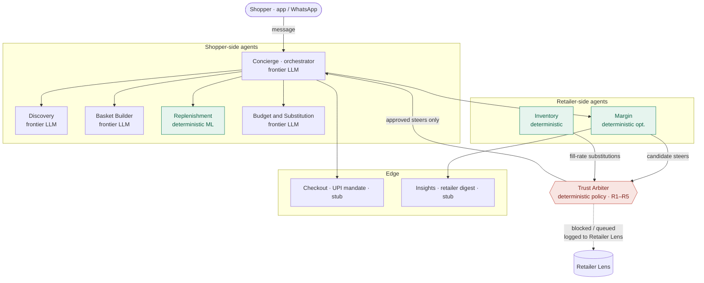

# Commerce Brain — a two-sided agentic grocery demo

> A working prototype for the CogitX product case. **Apna Aisle** is a fictional
> white-label Indian grocer; **Commerce Brain** is the platform layer that runs
> its shopping agents. One orchestrator, seven specialists, one referee — the
> two-sided thesis (a shopper autopilot *and* retailer margin agents, kept
> honest by a deterministic Trust Arbiter) made watchable in a browser.

This repo is the "functional prototype" and "coded agentic workflow" deliverables
from the case. It maps 1:1 to the deck: the arbiter's five rules are
[`src/agents/trust-arbiter.ts`](src/agents/trust-arbiter.ts), the end-to-end
trace on slide 6 is [`npm run demo:trace`](scripts/trace.ts), and the Retailer
Lens on slide 11 is the toggle in the top-right of the app.

Hand-rolled multi-agent orchestration. **No LangChain, no agent framework** — the
concierge's tool-calling loop is ~130 legible lines in
[`src/agents/orchestrator.ts`](src/agents/orchestrator.ts).

---

## Quick start

```bash
npm install
npm run dev        # http://localhost:3000 — runs in mock mode out of the box
```

No API key needed. See [Mock mode](#mock-mode) for why the demo is fully
functional offline.

```bash
npm run demo:trace # headless: prints the full agent trace for all 3 golden paths
npm test           # arbiter unit tests (one per rule + the deck's 3 rulings)
npm run build      # production build
```

To run the concierge on a **live** hosted model instead of scripted text:

```bash
export ANTHROPIC_API_KEY=sk-ant-...   # fills the frontier + SLM tiers via the bundled provider SDK; model IDs are env-overridable
npm run dev
```

---

## The three golden paths

Try these in the app (canned buttons are wired to them). Full saved runs are in
[`transcripts/`](transcripts/); screenshots in [`screenshots/`](screenshots/).

| # | Try it | What it demonstrates |
|---|--------|----------------------|
| 1 | *"Plan dinner for 4 under ₹800, veg"* | Discovery + Basket Builder + Budget agents compose a meal to a rupee cap. |
| 2 | **"My usual weekly order"** or the **Sunday 6 PM** button | The two-sided proof. Replenishment drafts 14 SKUs from consumption history; the Margin agent proposes steers; the **Trust Arbiter blocks the peanut-butter attach (R1), blocks the pricier refined-oil swap (R2), and approves the Apna Select atta swap (R1–R5)**. |
| 3 | *"Swap anything expiring soon for discounts"* | Expiry-clearance flow: perishables discounted with a disclosed use-by date (R4), capped at the steer budget (R5). |

**Path 2 is the thesis.** Open the **Retailer Lens** before you run it and watch
the margin agent covet the high-margin peanut butter and the pricier own-label
oil — then watch the arbiter block both before they ever reach the shopper.



---

## Architecture



**One design rule runs through it:** deterministic where the problem is
prediction, LLM where the problem is language. The replenishment forecast and the
margin ranking are arithmetic and optimisation — *no LLM invents a forecast.* The
LLM's job is to explain, negotiate, and converse.

### Agents

| Agent | Side | Tier | What it does | Code |
|-------|------|------|--------------|------|
| Concierge | shopper | frontier tier | Owns the conversation, routes intent, composes one reply. | `orchestrator.ts` |
| Discovery | shopper | frontier | Catalog search → candidate SKUs. | `tools.ts` → `search_catalog` |
| Basket Builder | shopper | frontier | Meal/list → basket lines with quantities. | `tools.ts` → `update_basket` |
| Replenishment | shopper | **deterministic** | Median purchase-interval forecast; drafts the weekly basket. | `replenishment.ts` |
| Budget & Substitution | shopper | frontier | ₹/kg reasoning, budget caps, honest swaps. | `tools.ts` → `check_budget` |
| Margin | retailer | **deterministic** | Ranks private-label / expiry / attach steers. Never sees the shopper. | `margin.ts` |
| Inventory | retailer | **deterministic** | Dark-store stock + fill-rate-aware substitution. | `tools.ts` (stock checks) |
| **Trust Arbiter** | **referee** | **deterministic** | Rules on every steer against R1–R5 before it reaches the shopper. | `trust-arbiter.ts` |
| Checkout | edge | stub | Simulated UPI Autopay mandate + slot. | `checkout.ts` |
| Insights | edge | stub | Retailer-facing weekly digest. | `insights.ts` |

The intent classifier is the **SLM tier** (a small hosted model live, keyword
heuristic in mock) — one cheap call per turn, per the deck's model-strategy slide.

### The Trust Arbiter's five rules (as code)

1. **R1** — Dietary/allergy constraints are absolute. No steer overrides them.
2. **R2** — Never suppress a cheaper equivalent the shopper already chose.
3. **R3** — Every steer carries a shopper-visible "why". No silent swaps.
4. **R4** — Expiry-risk steers must disclose the use-by date.
5. **R5** — Per-basket steer budget: max 2 flagged suggestions; the rest queue.

R1–R4 are per-candidate; R5 is a budget across the draft. A soft trade-off *score*
is computed for transparency (shown in the lens) but **never blocks** — only the
five rules do. Every ruling is logged with the exact rule cited.

For the full message lifecycle and a worked transcript, see
[`docs/workflow.md`](docs/workflow.md).

---

## Mock mode

The demo runs fully offline by default. `MOCK_MODE` resolves in
[`src/lib/mode.ts`](src/lib/mode.ts): **on** when there is no `ANTHROPIC_API_KEY`,
overridable with `MOCK_MODE=1` / `MOCK_MODE=0`.

The honest boundary: **only the concierge's natural language is scripted in mock
mode.** Everything that constitutes the thesis — intent routing, the replenishment
forecast, the margin ranking, and *every* Trust Arbiter ruling — is the same real
code in both modes. In live mode a real model call fills the concierge's seat and
emits the tool calls; in mock mode a scripted `MockDriver` plays the *same* real
tool calls and composes a plausible reply from the actual post-tool state. Swapping
the driver is the only difference (`orchestrator.ts`).

The driver interface is also the model-strategy boundary: the orchestration is
model-agnostic by design, and this demo happens to wire the live driver to the
Anthropic SDK. In production the same seat is filled per deployment mode - see
the model strategy in the deck (SLM-first; the frontier model is an escalation
path, not the backbone).

This is deliberate: a reviewer with no API key sees the identical agent behaviour
and identical arbiter rulings as one with a key. The safety story never depends on
the model.

### Real vs mocked

| Component | Mock mode | Live mode (`ANTHROPIC_API_KEY` set) |
|-----------|-----------|-------------------------------------|
| Intent classification | keyword heuristic | SLM-tier model call (falls back to heuristic on error) |
| Concierge language | scripted from real state | frontier-model tool-calling loop |
| Tool-calling orchestration | **real** (scripted plan of real calls) | **real** (model-emitted calls) |
| Replenishment forecast | **real** deterministic model | **real** deterministic model |
| Margin ranking | **real** deterministic | **real** deterministic |
| **Trust Arbiter rulings** | **real** policy engine | **real** policy engine |
| Catalog / household data | mock (~80 SKUs, 1 household, 8 wks history) | same mock data |
| Checkout / UPI mandate | simulated ("mandate confirmed") | simulated |
| Payments, WhatsApp, ONDC, VPC | not built | not built |
| Rate limit + token caps | n/a (no LLM cost) | per-IP 20/min, 500-char input, 700-token concierge cap |

---

## What I cut, what's mocked, what I'd validate in a pilot

**Cut (out of scope for a case prototype):**
- The Insights console UI, auth, and any golden path beyond the three above.
- Real payment plumbing, ACP/UCP/MCP/ONDC protocol code, VPC/sovereign deploy.
- A real vector store — catalog "search" is keyword + tag + unit-price filtering.

**Mocked (shape is real, data/rails are not):**
- The catalog (~80 SKUs) and one household's 8 weeks of order history.
- Checkout: a simulated UPI Autopay mandate, no gateway.
- The concierge's prose in the default (mock) mode — see above.

**Would validate in a pilot (the assumptions the demo can't settle):**
- Steer acceptance vs edit rate, split by steer type — does the arbiter's budget
  (R5=2) match real shopper tolerance, or does trust erode faster/slower?
- Forecast accuracy (MAPE) on real consumption data, and the cold-start threshold
  before autopilot is trustworthy per household.
- Whether "agent-attributed incremental margin" survives a finance team via
  holdout households — the attribution design, not the agents.

---

## Repo map

```
src/
  data/         catalog.ts (SKUs), household.ts (history), types.ts
  agents/
    registry.ts        agent definitions + model tiers (source of truth)
    orchestrator.ts    the concierge tool-calling loop (mock + live drivers)
    tools.ts           tool implementations (backs each specialist)
    replenishment.ts   deterministic consumption-interval forecast
    margin.ts          deterministic steer ranking
    trust-arbiter.ts   the R1–R5 policy engine  ← the thesis
    checkout.ts, insights.ts   stubs
  lib/          basket math, mode resolution, session store, runtime types
  components/   ChatPanel, BasketPanel, RetailerLens, Brand
app/
  page.tsx      the demo UI
  api/chat      shopper-message turns
  api/replenish agent-initiated "Sunday 6 PM" draft
scripts/trace.ts   demo:trace
tests/             arbiter unit tests
```
